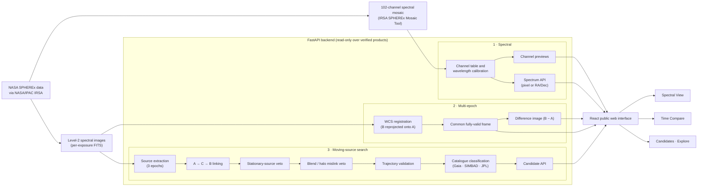

# SpectraShift

**A SPHEREx Spectral & Multi-Epoch Sky Explorer** — built for the NASA Space Apps 2026 *"Planet X and SPHEREx"* challenge.

SpectraShift lets anyone look at one region of the sky through NASA's SPHEREx mission in two directions at once: **across wavelength** (102 near-infrared channels) and **across time** (the same sky observed on different dates). On top of that it runs a conservative search for moving sources, with explicit safeguards against the most common false positives.

> **Scientific integrity:** SpectraShift does not claim any discovery. No object is labelled "Planet X", a new planet, or a confirmed moving object. The current motion-candidate pipeline accepts **zero** candidates, and an empty candidate list does **not** mean that no moving sources exist in the field.

---

## The problem

Searching for faint, slowly moving Solar System objects — the idea behind "Planet X" searches — requires comparing the same sky at different times and ruling out everything that only *looks* like motion. In a crowded star field, most apparent "movers" are artifacts: stationary stars linked across epochs by chance, blended sources, or features in the halo of a bright star. SPHEREx adds a second dimension: every sky position is observed across 0.75–5 µm, but a given exposure samples each position at a single wavelength.

Raw SPHEREx products are large FITS files that are hard to explore without specialist tools.

## The solution

SpectraShift turns real SPHEREx data into an interactive, honest web tool:

| View | Question it answers |
|---|---|
| **Spectral View** | *Same sky, same time* — what does this region look like at each of 102 wavelengths, and what is the spectrum at a given position? |
| **Time Compare** | *Same sky, different times* — what apparently changed between two registered observations? |
| **Candidates** | Did any source move consistently across three epochs, after stationary-source, blend and catalogue checks? |
| **Explore** | Browse a single SPHEREx epoch with zoom and pan. |

---

## Real NASA data

All imagery is real SPHEREx data retrieved from NASA/IPAC **IRSA** (SPHEREx Quick Release, DOI [10.26131/IRSA652](https://doi.org/10.26131/IRSA652)); nothing is simulated.

- **Spectral View:** a 102-channel spectral mosaic (5.0° × 4.25°, 6.15″ pixels) centred on RA 155.352°, Dec −42.700°, produced with the official IRSA SPHEREx Mosaic Tool.
- **~6-month Time Compare (primary):** two SPHEREx Level-2 detector-3 (SWIR) exposures of the same target —
  Epoch A `2025-06-19T00:00:58.754`, Epoch B `2025-12-17T18:35:43.129` — a **181.774-day** (~5.97-month) baseline, sampled at 1.684886 µm and 1.681677 µm (Δλ = 0.003209 µm, 0.08 of the channel bandwidth), PSF FWHM 5.22″ in both.
- **31-day Time Compare (secondary) and candidate pipeline:** three Level-2 detector-3 exposures, Epoch A (2025-05-09), C (2025-05-27) and B (2025-06-09).
- **Catalogues:** Gaia DR3, SIMBAD, the JPL Small-Body Identification service (all known asteroids and comets) and JPL Horizons.

---

## Architecture



More detail: [`docs/ARCHITECTURE.md`](docs/ARCHITECTURE.md).

---

## Features

### 102-channel Spectral View
- All **102 SPHEREx channels**, 0.743–5.009 µm, detectors **D1–D6**, with a wavelength bar, slider, Prev/Next, channel entry and ←/→ keys.
- Per-channel panel: detector, subchannel, wavelength range, bandwidth and **measured sky coverage** (97.08–99.76% of pixels with data).
- Click anywhere (or enter RA/Dec) to plot that position's brightness in all 102 channels.

### Multi-epoch Time Compare
- **~6-Month Compare (primary):** Jun 19 → Dec 17, 2025, Epoch B reprojected onto Epoch A's pixel grid and cut to one **1016 × 346 px** frame that lies entirely inside the common footprint (99.97% valid pixels) — so every mode is pixel-registered.
- **31-Day Compare (secondary):** Epochs A / C / B, with the precomputed A − B difference for the registered A/B pair.
- Five modes: **Side by Side, Slider, Blink, Difference, Overlay** (red/cyan).
- **Difference = B − A:** positive values mean higher surface brightness in the later epoch.
- Metadata panel with dates, baseline, wavelengths, detector, PSF, units, footprint, **target** and **frame centre** (labelled separately).

### Moving-source candidate pipeline with false-positive rejection
1. Source extraction in all three epochs (DAOStarFinder, 7σ; shape limits relaxed for SPHEREx's undersampled PSF; flagged bad pixels masked).
2. A → C → B linking with a constant-velocity prediction and an uncertainty-aware epoch-C gate.
3. **Stationary-source veto** — in sky coordinates, using an astrometric model calibrated from ~75,000 stationary source pairs (centroid σ ≈ 0.48–0.58″, registration σ ≈ 0.08–0.11″): a track is rejected if its detections are the same source at the same position in the other epochs.
4. **Blend / mislink veto** — tracks built around persistent sources or bright-star halos.
5. Trajectory validation, then catalogue classification (Gaia DR3 propagated to each epoch with proper motion, SIMBAD, JPL small-body search from the SPHEREx spacecraft's own position) into `KNOWN_OBJECT`, `UNMATCHED_AFTER_CHECKS` or `UNCERTAIN`, each with a written reason.

**Current result:** 725 linked tracks → **0 accepted** (673 stationary source, 52 blend/mislink, 0 inconsistent trajectory). The previous 22 "candidates" of an earlier pipeline version were all shown to be chance links of unrelated stationary stars and are no longer reported.

**Sensitivity checks:** the veto would reject a genuine mover about **10%** of the time (measured on random sky positions). In an injection–recovery test, 43% of 150 synthetic movers were recovered end to end and only 4.4% of the linked ones were vetoed; the losses come mainly from detection completeness in this crowded field.

---

## Scientific safeguards

- Real data only; missing values are shown as "—", never invented.
- Catalogue positions are propagated to each observation epoch; matches use combined uncertainties and chance-coincidence probabilities.
- `UNMATCHED_AFTER_CHECKS` requires every required check to have succeeded and never means "unknown" or "new".
- Stationary-source and blend vetoes run **before** a track can become a candidate; every rejected track is logged with its reason (`rejected_three_epoch_tracks.csv`).
- The site distinguishes Spectral View (wavelength) from Time Compare (time) on every relevant page.
- No discovery language anywhere; an empty candidate list is explained, not hidden.

---

## Tech stack

- **Frontend:** React 19, TypeScript, Vite, React Router
- **Backend:** Python, FastAPI, Uvicorn, NumPy, pandas, Astropy, SciPy, photutils, Pillow
- **Pipeline:** Astropy, photutils, reproject, astroquery (Gaia, SIMBAD, JPL Horizons), JPL Small-Body Identification API, Matplotlib
- **Tests:** pytest (backend), `tsc` + oxlint (frontend)

---

## API overview

| Endpoint | Purpose |
|---|---|
| `GET /api/health` | Data / file availability |
| `GET /api/spectral/status`, `/metadata` | Spectral mosaic status; all 102 channels with wavelengths, detectors and coverage |
| `GET /api/spectral/channels/{n}` · `/channels/{n}/preview` | One channel's metadata and preview PNG |
| `GET /api/spectral/spectrum?ra=&dec=` (or `x=&y=`) | Brightness of one position in all 102 channels |
| `GET /api/compare/6month` | ~6-month pair metadata and preview URLs |
| `GET /api/compare/6month/preview/{A\|B\|difference}` | Registered previews (difference = B − A) |
| `GET /api/compare/6month/figure/{name}` | Annotated reference figures |
| `GET /api/observations` · `/api/compare/pair` | 31-day epochs and pair configuration |
| `GET /api/observations/{epoch}/preview` · `/api/compare/difference-preview` | 31-day previews and A − B difference |
| `GET /api/linking-summary` | Latest linker run: tracks formed, accepted, rejected by reason |
| `GET /api/candidates` · `/api/candidates/{id}` | Current candidates (currently none) and details |
| `GET /api/catalogue-crossmatch/{id}` | Per-candidate catalogue audit trail |

Interactive docs: `http://127.0.0.1:8000/docs` when the backend is running.

---

## Installation and local running

Requirements: Python 3.11+, Node.js 20.19+ (or 22.12+).

The raw SPHEREx files are **not** in Git (multi-GB). Place them as follows:

| Data | Location |
|---|---|
| 102-channel mosaic (`SpectraShift_Part1_16.fits.gz`, `SpectraShift_Remaining86.fits.gz`) | `data/spherex/` |
| 31-day Level-2 frames (A, C, B) | project root (tracked) |
| ~6-month verified products | `data/time_compare_6month/` (tracked) |

```bash
# backend
cd backend
python -m pip install -r requirements.txt
python -m uvicorn main:app --host 127.0.0.1 --port 8000

# frontend (new terminal)
cd frontend
npm install
npm run dev            # http://localhost:5173
```

Optional: `python backend/build_spectral_cache.py` builds a ~3 GB fast-access cube for Spectral View (faster channel switching and spectra).

Re-running the science pipeline (optional, `pip install -r requirements-pipeline.txt`):

```bash
python three_epoch_compare.py        # detection, linking, stationary/blend vetoes
python validate_candidates.py        # trajectory validation
python catalogue_crossmatch_v3.py    # catalogue classification (cached queries)
python final_ranking.py              # priority ranking
python test_linker_injection.py      # optional: injection-recovery sensitivity test
```

Tests: `cd backend && python -m pytest tests/` · `cd frontend && npm run build && npm run lint`.

Deployment notes: [`docs/DEPLOYMENT.md`](docs/DEPLOYMENT.md). In production the Spectral View reads a lossless tile bundle of the full 102-channel cube from private Cloudflare R2 (`SPECTRASHIFT_SPECTRAL_BACKEND=r2`; build it with `python backend/build_r2_spectral_bundle.py`), so the server never downloads the 3 GB FITS files.

---

## Limitations

- **Zero candidates is not "no movers".** End-to-end recovery of injected movers is ~43% (flux 3–30), limited by detection completeness in a crowded field; the veto itself removes ~10% of genuine movers.
- The motion search covers straight-line motion of 5–120″ over 31 days (≈0.16–3.9″/day) in one detector (D3).
- DAOStarFinder cannot separate peaks closer than ~25″; blends are handled by vetoes rather than deblending.
- The ~6-month pair differs slightly in wavelength (Δλ = 0.0032 µm) and is compared after reprojection, so a difference residual is an *apparent* change, not a confirmed physical one.
- One sky region, one detector for Time Compare; the Spectral View mosaic is a single epoch.
- SkyBoT and the MPC Checker were unreachable; the equivalent asteroid/comet search used JPL's service.

## Future work

- PSF-fitting photometry and deblending to raise detection completeness.
- Shift-and-stack / synthetic tracking for fainter movers across more epochs.
- More sky regions and all six detectors in Time Compare.
- Wavelength-matched differencing using SPHEREx's per-pixel wavelength maps.
- A hosted deployment with a persistent data volume.

## Demo flow

See [`docs/DEMO_FLOW.md`](docs/DEMO_FLOW.md) — a 2–4 minute walkthrough: Home → Spectral View (channels, click-to-spectrum) → Time Compare (side by side, slider, blink, difference) → Candidates (vetoes and the zero-candidate result) → safeguards.

## Further documents

- [`docs/ARCHITECTURE.md`](docs/ARCHITECTURE.md) — architecture and data flow
- [`docs/DEMO_FLOW.md`](docs/DEMO_FLOW.md) — demo script
- [`docs/PROJECT_DESCRIPTIONS.md`](docs/PROJECT_DESCRIPTIONS.md) — short, medium and detailed descriptions
- [`docs/PRESENTATION.md`](docs/PRESENTATION.md) — slide-by-slide content
- [`docs/NASA_SUBMISSION.md`](docs/NASA_SUBMISSION.md) — submission draft
- [`PROJECT_SUMMARY.md`](PROJECT_SUMMARY.md) — development history
