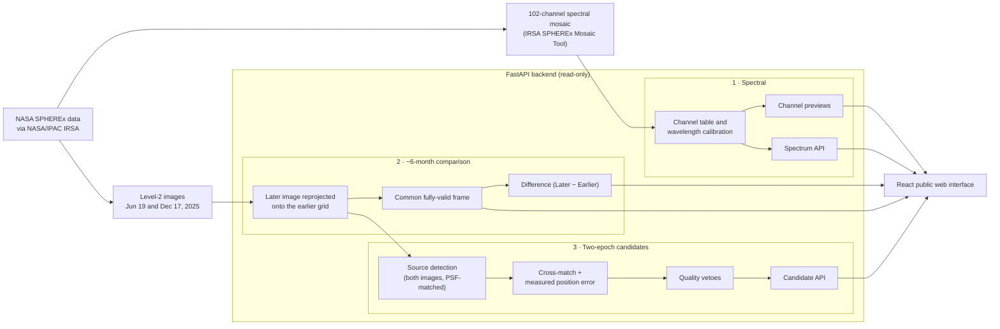

# SpectraShift

**A SPHEREx spectral and ~6-month two-epoch sky explorer**, built for the NASA Space Apps 2026 *"Planet X and SPHEREx"* challenge.

**Live site:** https://spectrashift.rafincs3023.workers.dev

SpectraShift lets anyone look at one region of the sky through NASA's SPHEREx mission in two directions:

- **Across wavelength:** 102 near-infrared channels.
- **Across time:** the same sky observed on **June 19, 2025** and **December 17, 2025**, 181.77 days apart.

It also screens those two observations for **possible moving-source candidates**, with explicit safeguards against the most common false positives.

> **Scientific integrity:** SpectraShift does not claim any discovery. No object is labelled "Planet X", a new planet or a confirmed moving object. Candidates are preliminary two-epoch changes that passed the current checks. Two observations cannot establish a trajectory or an orbit.

---

## The problem

Searching for faint, slowly moving objects means comparing the same sky at different times and ruling out everything that only *looks* like a change. In a crowded star field, most apparent changes are artifacts:

- blended stars
- bright-star glare
- flagged or corrupted pixels
- centroid errors on the undersampled SPHEREx PSF

SPHEREx adds a second dimension: every sky position is observed across 0.75–5 µm, but one exposure samples each position at a single wavelength. Raw SPHEREx products are large FITS files that are hard to explore without specialist tools.

## The solution

| View | Question it answers |
|---|---|
| **Spectral View** | *Same sky, same time:* what does this region look like at each of 102 wavelengths, and what is the spectrum at a given position? |
| **Time Compare** | *Same sky, about six months apart:* what apparently changed between Jun 19 and Dec 17, 2025? |
| **Explore** | Inspect either real observation in detail, with candidate markers. |
| **Candidates** | Which sources changed position or appearance between the two dates enough to deserve inspection, after quality checks? |

The workflow runs as follows. SPHEREx data feeds two tracks:

- **Wavelength:** the 102-channel spectral mosaic, for spectral exploration.
- **Time:** the Jun 19, 2025 and Dec 17, 2025 observations are registered into a ~6-month comparison, then screened for two-epoch change/motion candidates.

Both tracks end in public web exploration.

---

## Real NASA data

All imagery is real SPHEREx data retrieved from NASA/IPAC **IRSA** (SPHEREx Quick Release, DOI [10.26131/IRSA652](https://doi.org/10.26131/IRSA652)). Nothing is simulated.

- **Spectral View:** a 102-channel spectral mosaic (5.0° × 4.25°, 6.15″ pixels), centred on RA 155.352°, Dec −42.700°. It was produced with the official IRSA SPHEREx Mosaic Tool.
- **Time Compare and Candidates:** two SPHEREx Level-2 detector-3 (SWIR) exposures of the same target.

| | Earlier observation | Later observation |
|---|---|---|
| Time (UTC) | `2025-06-19T00:00:58.754` | `2025-12-17T18:35:43.129` |
| File | `level2_2025W25_1B_0652_1D3_spx_l2b-v20-2025-253.fits` | `level2_2025W51_1A_0594_2D3_spx_l2b-v21-2025-354.fits` |
| Wavelength | 1.684886 µm | 1.681677 µm |

- **Baseline:** 181.774125 days (~5.97 months).
- **PSF FWHM:** 5.22″ (header) in both images.
- **Difference convention:** Later − Earlier, in MJy/sr.
- **Alignment:** the later image is reprojected onto the earlier grid (`data/time_compare_6month/`).

---

## Architecture



More detail: [`docs/ARCHITECTURE.md`](docs/ARCHITECTURE.md).

---

## Features

### 102-channel Spectral View
- All **102 SPHEREx channels**, 0.743–5.009 µm, on detectors **D1–D6**.
- Navigation by wavelength bar, slider, Prev/Next, channel entry or the ←/→ keys.
- A per-channel panel shows detector, wavelength range, bandwidth and **measured sky coverage**.
- Click anywhere (or enter RA/Dec) to plot that position's brightness in all 102 channels.

### ~6-month Time Compare
- Jun 19 → Dec 17, 2025, cut to one **1016 × 346 px** frame that lies entirely inside the common footprint (99.97% valid pixels), so every mode is pixel-registered.
- Five modes: **Side by Side, Slider, Blink, Difference, Overlay**.
- **Difference = Later − Earlier:**
  - red: brighter in the later image
  - blue: brighter in the earlier image
  - dark: little or no change

  A difference does not automatically mean that an object moved.

### Two-epoch candidate pipeline (`backend/two_epoch_candidates.py`)
Inputs are only the two ~6-month images, their overlap mask, the B − A difference and the FLAGS of the two source frames.

1. **Background and noise:** sigma-clipped median/MAD in 32 px boxes.
2. **PSF matching:** the sharper image (FWHM 9.1″ measured) is blurred to the other's 10.9″, so detection depth, shape tests and centroid biases are symmetric.
3. **Detection:** each image separately, with a matched filter at ≥ 5σ. The noise is measured on the filtered image itself, because the reprojected later image has correlated noise.
4. **Cross-match** on the shared grid (mutual nearest neighbour within 1 FWHM).
   - The epoch-to-epoch position error is **measured** from about 6,500 matched sources: σ² = floor² + k²(1/SNR₁² + 1/SNR₂²), with floor 0.63″ and k 3.0″.
   - A source is **stationary** within 5σ. With ~6,500 matches, a 3σ cut would pass ~70 noise pairs; 5σ leaves an expected 0.02.
5. **Forced photometry** at the same position in the other image: a source still present at ≥ 3σ is not a change.
6. **Quality vetoes:**
   - footprint edge
   - SPHEREx-flagged pixels (both images; the later image is mapped back to its native pixels)
   - corrupted strongly negative pixels
   - non-star-like shape (single-pixel spikes)
   - bright-star halo
   - blends and crowding
   - poor or clipped centroids
   - a difference image that does not show the change at ≥ 5σ with the right sign
7. **Candidate types:**
   - **possible position change:** an earlier-only source paired with a similar later-only source.
   - **small position shift:** matched, but beyond 5σ and SNR ≥ 10.
   - **seen only in the earlier / later image.**

   Rate = displacement / 181.774125 days. There is no invented "planet probability" score.

**Current result** (`data/time_compare_6month/two_epoch_candidates.json`):

- Detections: 7,533 in the earlier image and 6,790 in the later one; 6,472 are found in both.
- **11 candidates passed the current checks.**
  - **0 possible position changes.**
  - 10 small position shifts, of 3.8–9.1″.
  - 1 source seen only in the earlier image.
  - 0 sources seen only in the later image.
- Rejected, by first failed check:

  | Check | Rejected |
  |---|---|
  | stationary | 6,331 |
  | present in both | 1,214 |
  | flagged pixel | 158 |
  | poor centroid | 62 |
  | footprint edge | 34 |
  | corrupted pixel | 14 |
  | blend | 13 |
  | bright-star halo | 12 |
  | not star-like | 1 |
  | difference disagrees | 1 |

The small shifts sit in the long tail of the measured position errors. 141 matched sources lie beyond 5σ, versus 0.02 for Gaussian errors, so blends and pixel sampling are the likely cause. A real shift that small over six months would need a nearby star with a very high proper motion; no Solar System object moves that slowly. Every candidate is for inspection only.

**Validation** (`backend/tests/test_two_epoch_candidates.py`) runs on synthetic star fields, never the real files:

- An injected large position change is recovered as a pair (separation within 0.3 px).
- An injected 1.5 px shift of a bright star is recovered.
- All 250 stationary stars are rejected.
- Edge, flagged-pixel and single-pixel-spike look-alikes are rejected for the right reason.
- Zero displacement is always stationary.

On the real data the tests check that:

- the stored results equal a fresh run
- only the Jun 19 / Dec 17 files are used
- every candidate lies in the shared footprint
- rate = displacement / 181.774125 days

---

## Scientific safeguards

- Real data only; missing values are shown as "—", never invented.
- Thresholds are measured from the data or derived from stated trial counts; each is reported on the Candidates page.
- The difference image is supporting evidence only, never the sole basis for a candidate.
- The site keeps Spectral View (wavelength) and Time Compare (time) apart on every relevant page.
- No discovery language anywhere; a zero result is explained, not hidden.

---

## Tech stack

- **Frontend:** React 19, TypeScript, Vite, React Router (Cloudflare Workers)
- **Backend:** Python, FastAPI, Uvicorn, NumPy, SciPy, Astropy, Pillow, boto3 (Railway; spectral tiles in private Cloudflare R2)
- **Tests:** pytest (backend); `tsc` and oxlint (frontend)

---

## API overview

| Endpoint | Purpose |
|---|---|
| `GET /api/health` | Data availability |
| `GET /api/spectral/status`, `/metadata` | Spectral mosaic status; all 102 channels |
| `GET /api/spectral/channels/{n}` · `/channels/{n}/preview` | One channel's metadata and preview PNG |
| `GET /api/spectral/spectrum?ra=&dec=` (or `x=&y=`) | Brightness of one position in all 102 channels |
| `GET /api/compare/6month` | ~6-month pair metadata and preview URLs |
| `GET /api/compare/6month/preview/{A\|B\|difference}` | Registered previews (difference = Later − Earlier) |
| `GET /api/compare/6month/figure/{name}` | Annotated reference figures |
| `GET /api/candidates` | Two-epoch candidates, rejection counts, thresholds, limitations |
| `GET /api/candidates/markers?image=earlier\|later` | Marker positions on the displayed frame |
| `GET /api/candidates/{id}` · `/api/candidates/{id}/cutout/{earlier\|later\|difference}` | Candidate details and real-pixel cutouts |

Interactive docs: `http://127.0.0.1:8000/docs` when the backend is running.

---

## Installation and local running

Requirements: Python 3.11+, Node.js 20.19+ (or 22.12+).

| Data | Location |
|---|---|
| 102-channel mosaic (`SpectraShift_Part1_16.fits.gz`, `SpectraShift_Remaining86.fits.gz`, not in Git) | `data/spherex/` |
| ~6-month products and two-epoch results | `data/time_compare_6month/` (tracked) |
| The two ~6-month Level-2 source frames | project root (tracked) |

```bash
# backend
cd backend
python -m pip install -r requirements.txt
python -m uvicorn main:app --host 127.0.0.1 --port 8000

# frontend (new terminal)
cd frontend
npm install
npm run dev            # http://localhost:5173
```

Re-run the two-epoch candidate pipeline (a few seconds):

```bash
python backend/two_epoch_candidates.py   # rewrites data/time_compare_6month/two_epoch_candidates.json
```

Tests: `cd backend && python -m pytest tests/` · `cd frontend && npm run build && npm run lint`.

Deployment: [`docs/DEPLOYMENT.md`](docs/DEPLOYMENT.md).

---

## Limitations

- **Two epochs cannot establish a trajectory, acceleration or an orbit.** A candidate is a possible change, never a measured path.
- An earlier-only / later-only pairing is a possibility; other pairings may be equally possible.
- A source seen on one date only may be variable, an artifact or noise.
- The two images differ slightly in wavelength (Δλ = 0.0032 µm) and in sharpness, so a difference is an *apparent* change.
- Detection completeness is limited in this crowded field: an empty or short candidate list does not mean that nothing moves here.
- One sky region and one detector (D3) for the time comparison.

## Future work

- More epochs of the same field, so that candidates can be tested for a consistent path.
- PSF-fitting photometry and deblending.
- Catalogue checks (Gaia, SIMBAD, known Solar System objects) for the two-epoch candidates.
- More sky regions and detectors.

## Further documents

- [`docs/ARCHITECTURE.md`](docs/ARCHITECTURE.md): architecture and data flow
- [`docs/DEMO_FLOW.md`](docs/DEMO_FLOW.md): demo script
- [`docs/PROJECT_DESCRIPTIONS.md`](docs/PROJECT_DESCRIPTIONS.md): short, medium and detailed descriptions
- [`docs/PRESENTATION.md`](docs/PRESENTATION.md): slide-by-slide content
- [`docs/NASA_SUBMISSION.md`](docs/NASA_SUBMISSION.md): submission draft
- [`docs/DEPLOYMENT.md`](docs/DEPLOYMENT.md): production setup
