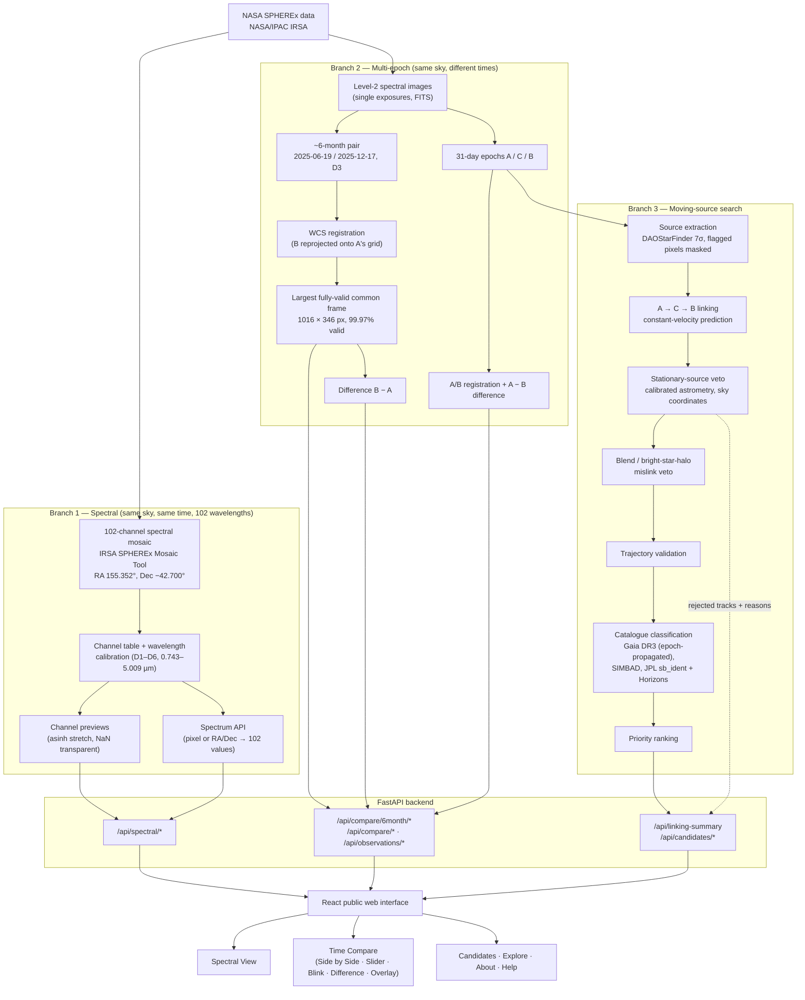

# SpectraShift — Architecture & Data Flow

SpectraShift has three layers:

1. **Offline science pipeline** (Python scripts at the project root) that turns real SPHEREx FITS products into verified derived data.
2. **FastAPI backend** (`backend/`) — read-only over those products; it renders previews and serves JSON, but never re-runs detection, linking or catalogue classification.
3. **React frontend** (`frontend/`) — the public interface.

## End-to-end flow

## Components

| Component | Files | Role |
|---|---|---|
| Spectral data service | `backend/spectral_data.py`, `backend/spectral_api.py`, `backend/build_spectral_cache.py` | Reads the two mosaic FITS files (16 + 86 channels) directly or from an optional memory-mapped cube; channel table, previews, spectra |
| ~6-month compare | `backend/time_compare_6month.py`, `data/time_compare_6month/`, `build_6month_difference.py` | Serves the verified registered pair; chooses the fully-valid display frame from `overlap_mask.fits` |
| 31-day compare + candidates | `backend/main.py`, `backend/images.py`, `backend/data_access.py`, `backend/spectrum.py` | Epoch previews, A − B difference, candidate JSON, linking summary |
| Linker + vetoes | `three_epoch_compare.py` | Detection, calibration, linking, stationary/blend/trajectory vetoes; writes candidates, rejected tracks, calibration |
| Validation | `validate_candidates.py` | Trajectory, rate, C-prediction and flux consistency |
| Catalogue classification | `catalogue_crossmatch_v3.py` | Epoch-propagated, uncertainty-aware catalogue matching and status reasons |
| Ranking | `final_ranking.py` | Combines validation and catalogue status |
| Sensitivity test | `test_linker_injection.py` | Injection–recovery of synthetic movers |
| Frontend | `frontend/src/` | Pages: Home, Spectral View, Compare, Explore, Candidates, Candidate Detail, About, Help |

## Design principles

- **Read-only API:** the web tier serves verified products; heavy science runs offline and is reproducible from scripts.
- **Sky coordinates everywhere** for cross-epoch tests; pixel registration only where a product was explicitly reprojected.
- **No hidden failures:** missing values are `null`/"—"; rejected tracks and failed services are recorded, not dropped.
- **Small browser payloads:** the browser only receives PNG previews and JSON; FITS files are never sent to it.
