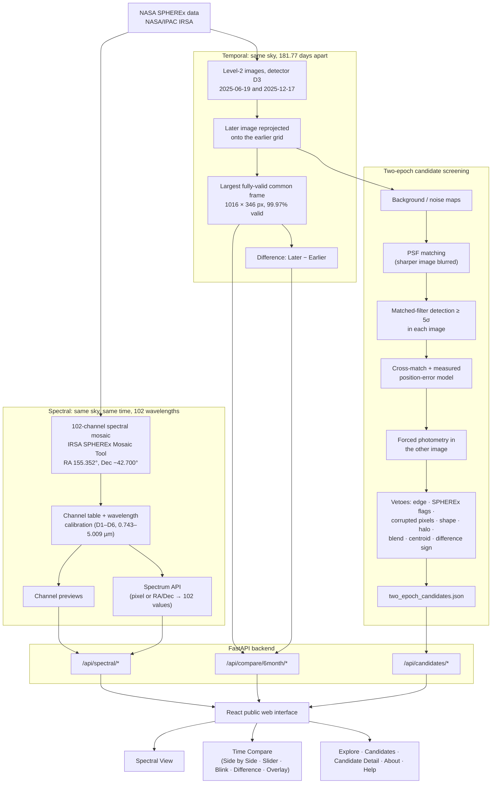

# SpectraShift — Architecture & Data Flow

SpectraShift has two layers:

1. **FastAPI backend** (`backend/`), which is read-only over real SPHEREx products. It serves:
   - the 102-channel spectral data
   - the verified ~6-month pair
   - the two-epoch candidates found in that pair

   The candidate pipeline is a small, deterministic module whose results are stored as JSON and regenerated with one command.
2. **React frontend** (`frontend/`), the public interface.

The current product story runs like this. SPHEREx data feeds two tracks:

- **Wavelength:** the 102-channel spectral mosaic, for spectral exploration.
- **Time:** the Jun 19, 2025 and Dec 17, 2025 observations are registered into a ~6-month comparison, then screened for two-epoch change/motion candidates.

Both tracks end in public web exploration.

## End-to-end flow

## Components

| Component | Files | Role |
|---|---|---|
| Spectral data service | `backend/spectral_data.py`, `backend/spectral_api.py`, `backend/spectral_r2.py`, `backend/build_spectral_cache.py`, `backend/build_r2_spectral_bundle.py` | 102-channel mosaic: channel table, previews, spectra (local FITS/cache or private R2 tiles) |
| ~6-month compare | `backend/time_compare_6month.py`, `data/time_compare_6month/`, `build_6month_difference.py` | Serves the verified registered pair; chooses the fully-valid display frame from `overlap_mask.fits` |
| Two-epoch pipeline | `backend/two_epoch_candidates.py` | Detection, matching, vetoes, pairing; writes `two_epoch_candidates.json` |
| Candidate API | `backend/candidates_api.py` | Candidate list, markers on the display frame, details, real-pixel cutouts |
| Rendering helpers | `backend/images.py` | asinh stretch and red/blue difference rendering |
| Tests | `backend/tests/` | Spectral, ~6-month and two-epoch (synthetic + real-data sanity + API) tests |
| Frontend | `frontend/src/` | Home, Spectral View, Time Compare, Explore, Candidates, Candidate Detail, About, Help |

The earlier short-baseline work is kept in `archive/short_baseline_31day/` for repository history only. Nothing there is imported by the backend or shown in the product, and it is excluded from the production image (`.dockerignore`).

## Design principles

- **Only the ~6-month pair** feeds temporal exploration and candidates.
- **Measured, not assumed:** the FWHM, noise, alignment residual and position-error model are all measured from the two images. Thresholds are derived from trial counts (for example, the 5σ stationary tolerance).
- **No hidden failures:** missing values are `null`/"—"; every rejection reason is counted and reported.
- **Small browser payloads:** the browser receives only PNG previews, cutouts and JSON; FITS files are never sent to it.
